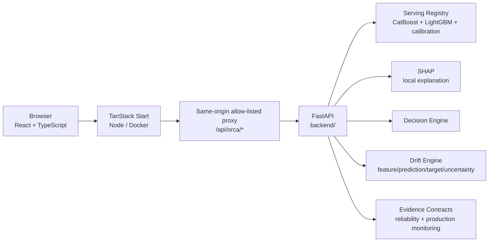

<div align="center">

# ORCA Control Tower

**Supply Chain Decision Intelligence — Sense → Predict → Explain → Simulate → Decide**


**[Repository](https://github.com/EslamTagElsir/orca-control-tower)** · **[Legacy Published App](https://orca-control-tower.lovable.app)**

> GitHub is the canonical source of truth. The frontend builds with the native TanStack Start + Nitro toolchain and has a standalone Node/Docker runtime. The legacy Lovable URL can lag the repository until separately republished.

</div>

## Overview

ORCA is an enterprise-style supply-chain decision intelligence system built as a single monorepo with two independently deployable layers:

- a React / TanStack Start Control Tower at the repository root;
- a FastAPI / ML intelligence service under `backend/`.

The product deliberately separates **operational experience**, **model evidence**, **simulation**, and **production monitoring** so the UI does not present research holdout metrics or synthetic events as live production truth.

```text
Sense → Predict → Explain → Simulate → Decide
```

## Repository structure

```text
orca-control-tower/
├── src/                              # React / TanStack Start frontend
│   ├── components/orca/              # application shell + ORCA UI primitives
│   ├── lib/orca/                     # transport, model evidence, monitoring clients
│   └── routes/                       # product pages + same-origin ORCA proxy
├── Dockerfile                        # standalone frontend Node container
├── .dockerignore                     # scoped frontend Docker build context
├── vite.config.ts                    # native TanStack Start + Nitro node-server build
├── backend/
│   ├── src/delay_intelligence/       # FastAPI + model/decision/drift packages
│   ├── configs/                      # decision, drift, model-related configuration
│   ├── artifacts/model_registry/v2/  # serving registry and locked validation evidence
│   ├── contracts/                    # formal production evidence contracts
│   ├── tests/                        # API/evidence/monitoring contract tests
│   ├── Dockerfile
│   └── requirements.railway.txt
├── docs/
│   ├── EVIDENCE_POLICY.md
│   ├── REPRODUCIBILITY.md
│   └── MONITORING.md
├── .github/workflows/ci.yml
└── README.md
```

## Product areas

| Screen | Purpose |
|---|---|
| **Control Tower** | Operational command center with risk, exceptions, events and KPIs. |
| **Shipments** | Shipment search, inspection, model prediction and explanation. |
| **Exceptions** | Action-focused view of risk and active operational exceptions. |
| **Resolution Hub** | Prioritized resolution workflow for operational exceptions. |
| **Network Map** | Synthetic route/position visualization with explicit provenance. |
| **Analytics** | Completed-journey / holdout outcome analytics. |
| **What-If Simulator** | Scenario workbench that re-scores simulated inputs through ORCA. |
| **Decision Economics** | Planning economics around simulated interventions; not realized savings. |
| **Model Reliability** | Registry-backed temporal-holdout reliability and uncertainty evidence. |
| **Drift Readiness** | Separates drift capability, historical evaluation and live-production monitoring readiness. |
| **Evidence Reports** | Exportable JSON/Markdown Evidence Pack with provenance preserved. |
| **Settings & Diagnostics** | Transport configuration plus health/reliability/monitoring diagnostics. |

The application shell is responsive: desktop navigation is grouped by Operations, Intelligence and Governance; mobile navigation uses an accessible drawer with route-aware closing and Escape support.

## Architecture



The server-side proxy is intentionally allow-listed. Adding a backend route does not automatically expose it to the browser.

## Backend API

The frontend currently uses six explicit ORCA contracts:

| Endpoint | Method | Purpose |
|---|---:|---|
| `/health` | `GET` | Service/model health and serving metadata. |
| `/reliability` | `GET` | Frozen serving-registry temporal-holdout reliability evidence. |
| `/monitoring-readiness` | `GET` | Truthful drift/production-monitoring readiness and blockers. |
| `/predict` | `POST` | Calibrated late-risk probability, decision tier and severity uncertainty. |
| `/explain` | `POST` | SHAP predictive drivers plus exploratory causal candidates. |
| `/recommend` | `POST` | Decision-engine recommendation for a simulated decision request. |

No `/demo/*` backend routes are required by the current frontend integration.

## ML / decision intelligence layer

The bundled serving registry currently contains:

- CatBoost late-risk classification;
- isotonic probability calibration;
- LightGBM `q05`, `q50`, `q95` conditional severity models;
- split CQR uncertainty evidence;
- CatBoost local SHAP explanation;
- a decision-engine recommendation layer;
- exploratory causal-stability evidence that is never presented as identified intervention efficacy.

The repository registry declares model version `v2.0.0-demo` and prediction contract `v1.0`.

## Reliability evidence

`GET /reliability`, Model Reliability and Evidence Reports read the locked serving-registry validation artifacts. They do not re-run evaluation per request and do not substitute fixture values.

The current registry includes temporal holdout evidence such as ROC-AUC, PR-AUC, Brier score, precision/recall/F1, balanced accuracy, frozen decision threshold, CQR coverage and interval-width diagnostics.

These are **historical temporal-holdout measurements**, not live production SLA or drift measurements.

## Monitoring evidence layers

ORCA distinguishes three layers:

1. **Serving-registry reliability** — immutable temporal holdout evidence.
2. **Historical development drift** — chronological CV/development drift analysis with final-holdout quarantine.
3. **Live production drift** — only valid after a separately produced production artifact satisfies contract `1.0` and matches the active serving registry.

Production monitoring is promoted to `CONNECTED` only when:

```text
backend/artifacts/monitoring/latest.json
```

exists and passes:

```text
backend/contracts/production_drift_artifact.schema.json
```

plus the runtime validator in `delay_intelligence.monitoring.readiness`.

Until then, `GET /monitoring-readiness` intentionally reports `NOT_CONNECTED` with explicit blockers instead of inventing drift values.

See [`docs/MONITORING.md`](docs/MONITORING.md).

## Data provenance and trust

| Label | Meaning |
|---|---|
| **REAL DATA** | Frozen source/holdout records and completed historical outcomes used by the research/demo workflow. |
| **MODEL OUTPUT** | Prediction/explanation outputs from the serving model. |
| **SIMULATED SCENARIO** | What-if inputs and planning context. |
| **SYNTHETIC LIVE OPERATIONS** | Generated operational events for the digital-twin demonstration. |
| **SYNTHETIC ROUTE / POSITION** | Generated map movement; not GPS/AIS/TMS/ERP/IoT telemetry. |
| **PRODUCTION MONITORING** | A separately versioned monitoring artifact that passes the production evidence contract. |
| **OFFLINE FIXTURE DATA — NOT ORCA OUTPUT** | Explicit fallback data when the intelligence service is unavailable. |

Detailed policy: [`docs/EVIDENCE_POLICY.md`](docs/EVIDENCE_POLICY.md).

## Evidence Pack

The Evidence Reports page exports registry-backed evidence as JSON or Markdown while preserving:

- model version;
- prediction contract version;
- registry/evaluation roles;
- evaluation data SHA-256;
- temporal split chronology;
- classification metrics;
- severity CQR coverage and interval-width evidence;
- interpretation boundaries.

The Evidence Pack does not claim live drift, live SLA, future reliability or realized causal impact.

## CI and reproducibility

GitHub Actions currently performs:

- frozen Bun dependency installation;
- a permanent assertion that `package.json`, `bun.lock`, and `vite.config.ts` contain no `@lovable.dev/*` build/runtime package references;
- targeted ESLint checks for the hardened ORCA surfaces;
- a full frontend production build;
- a standalone frontend Docker image build;
- a real container runtime smoke test that starts the Node server and requests `/settings` over HTTP;
- Python source compilation;
- API leakage contract tests;
- serving-registry integrity tests;
- historical drift-readiness boundary tests;
- production monitoring artifact contract tests.

The hardening branch has been validated with **18 backend contract tests passing**, targeted frontend lint, the full native TanStack/Nitro build, the standalone Docker build, and the live container HTTP smoke test.

A repository-wide `eslint .` still exposes substantial pre-existing formatting/legacy/generated-code debt. This work is intentionally kept separate instead of silently reformatting unrelated application surfaces.

Reproducibility guide: [`docs/REPRODUCIBILITY.md`](docs/REPRODUCIBILITY.md).

## Local development

### Backend

```bash
cd backend
python -m venv .venv
pip install -r requirements.railway.txt
PYTHONPATH=src uvicorn delay_intelligence.api.main:app --host 0.0.0.0 --port 8000 --reload
```

PowerShell:

```powershell
$env:PYTHONPATH="src"
uvicorn delay_intelligence.api.main:app --host 0.0.0.0 --port 8000 --reload
```

Useful checks:

```text
http://127.0.0.1:8000/health
http://127.0.0.1:8000/reliability
http://127.0.0.1:8000/monitoring-readiness
```

### Frontend

At repository root:

```bash
bun install --frozen-lockfile
cp .env.example .env
bun run dev
```

For a local backend:

```text
ORCA_API_INTERNAL_URL=http://127.0.0.1:8000
```

The browser calls `/api/orca/*`; the TanStack Start server proxy forwards only allow-listed contracts to FastAPI.

### Production-style frontend locally

```bash
bun run build
ORCA_API_INTERNAL_URL=http://127.0.0.1:8000 bun run start
```

The native Nitro build is explicitly pinned to the `node-server` preset and emits:

```text
.output/server/index.mjs
```

## Deployment

### Frontend — canonical GitHub / Node / Docker path

The frontend does not require Lovable to install, build, or run. The original `@lovable.dev/mcp-js` and `@lovable.dev/vite-tanstack-config` package dependencies were removed with Bun, and the regenerated lockfile is committed to the repository. CI prevents these build/runtime package references from being reintroduced.

The root `Dockerfile` creates a standalone Node image from the native TanStack Start + Nitro output.

Build it from the repository root:

```bash
docker build -t orca-frontend .
```

Run it with the backend base URL as a server-side environment variable:

```bash
docker run --rm \
  -p 3000:3000 \
  -e PORT=3000 \
  -e HOST=0.0.0.0 \
  -e ORCA_API_INTERNAL_URL=https://YOUR-ORCA-BACKEND \
  orca-frontend
```

Then verify:

```text
http://127.0.0.1:3000/settings
```

This deployment shape is suitable for container hosts such as Railway or other Node/Docker platforms. The Docker runtime is continuously smoke-tested in GitHub Actions.

### Legacy Lovable publication

`https://orca-control-tower.lovable.app` remains a legacy published surface and may lag GitHub. It is not required by the current dependency graph, native build, Docker runtime, or GitHub CI path.

Repository metadata such as `.lovable/project.json` may remain for historical/project-link context; it is excluded from the frontend Docker build context and is not a build/runtime dependency.

### Backend — Railway / Docker

Use this same monorepo and configure Railway **Root Directory** as:

```text
/backend
```

The backend Dockerfile starts:

```text
uvicorn delay_intelligence.api.main:app --host 0.0.0.0 --port ${PORT:-8000}
```

See [`backend/README_RAILWAY.md`](backend/README_RAILWAY.md) for exact verification steps.

## Design principles

- GitHub is the canonical source of truth for development and deployment artifacts.
- One canonical product repository with separately deployable frontend/backend services.
- Frontend build/runtime is portable and does not require Lovable packages or the Lovable build wrapper.
- Evidence semantics are explicit in both API and UI.
- No fabricated model, monitoring or business metrics.
- Synthetic operations are never described as real telemetry.
- Holdout reliability is never promoted to live production drift.
- Production monitoring requires a versioned artifact tied to the serving model contract.
- Architecture is ready for future ERP/TMS/carrier integrations without pretending those integrations already exist.

## Research / demo scope

ORCA is a research-validated, demonstration-oriented decision intelligence prototype. The predictive serving registry uses historical evidence, while the digital-twin operational layer remains synthetic unless real operational systems are explicitly connected.

## Legacy backend repository

The canonical backend is now `backend/` in this monorepo. The legacy `EslamTagElsir/orca-backend` repository should remain only as temporary rollback/reference material until monorepo deployment verification is complete, then it can be archived to avoid divergence.

## License

No license file is currently included. No usage license should be inferred from repository visibility alone.
