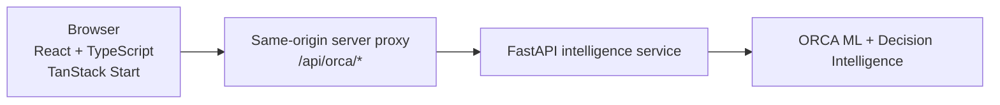

<div align="center">

# ORCA Control Tower

**Supply Chain Decision Intelligence — Sense → Predict → Explain → Simulate → Decide**

<div align="center">


</div>

**[Live App](https://orca-control-tower.lovable.app)** · **[GitHub Repository](https://github.com/EslamTagElsir/orca-control-tower)** · **[Lovable Editor](https://lovable.dev/projects/5f9c9dc3-04f6-409f-8f74-c04ca6fc140c)**

> **Note:** The repository source may be ahead of the currently published Lovable deployment.

</div>

## Table of Contents

- [What ORCA Does](#what-orca-does)
- [Product Areas](#product-areas)
- [Architecture](#architecture)
- [Backend API](#backend-api)
- [Data Provenance & Trust](#data-provenance--trust)
- [Digital Twin / Simulation](#digital-twin--simulation)
- [Tech Stack](#tech-stack)
- [Local Development](#local-development)
- [Available Scripts](#available-scripts)
- [Design Principles](#design-principles)
- [Research / Demo Scope](#research--demo-scope)
- [Repository Scope](#repository-scope)
- [License](#license)

## What ORCA Does

ORCA Control Tower is an enterprise-style supply-chain decision intelligence **frontend application layer**. It connects to a separate FastAPI/ML intelligence service and visualizes network risk, shipment-level predictions, explanations, recommendations, and what-if scenarios. The frontend does not reimplement the models; it orchestrates, explains, and helps operators act on model output.

The ORCA workflow follows five stages:

```
Sense → Predict → Explain → Simulate → Decide
```

| Stage | What happens in ORCA |
|-------|----------------------|
| **Sense** | Monitor the shipment portfolio, lanes, and live operational events. |
| **Predict** | Score journeys with the ORCA late-risk classifier via `/predict`. |
| **Explain** | Understand why a shipment scored the way it did with SHAP local explanations via `/explain`. |
| **Simulate** | Run alternative plans and synthetic scenarios through the model. |
| **Decide** | Compare economics and receive decision recommendations via `/recommend`. |

This repository contains only the frontend application layer. The FastAPI/ML backend is a separate service in the deployed architecture.

## Product Areas

| Screen | Purpose |
|--------|---------|
| **Control Tower** | Flagship operational dashboard with KPIs, risk map, live event stream, priority exceptions, and risky lanes. |
| **Shipments** | Shipment intelligence workspace for search, inspection, scoring, and explanation. |
| **Exceptions** | Priority exceptions view focused on actionability and model-backed severity. |
| **Network Map** | Full-page interactive map of lanes, routes, and risk concentration. |
| **Analytics** | Journey Performance Analytics for completed/historical holdout journeys and actual outcomes. |
| **What-If Simulator** | Scenario workbench for running alternative shipment plans through the model. |
| **Decision Economics** | Economic comparison of scenario results and recommendation outputs. |
| **Model Monitor** | Model health, version, and behavior diagnostics. |
| **Settings** | Connection mode, server proxy configuration, and demo preferences. |

## Architecture



The frontend talks to the ORCA backend through a same-origin server proxy at `/api/orca/*`. Configure the upstream with `ORCA_API_INTERNAL_URL` (fallback `ORCA_API_URL`). This keeps API keys and internal URLs off the client and avoids CORS issues for the primary path.

The ML intelligence layer includes:

- CatBoost late-risk classifier + calibration
- LightGBM quantile severity models
- Conformal / CQR uncertainty estimation
- SHAP local explanations
- Decision engine recommendations

## Backend API

The frontend uses exactly these four endpoints. It does not require or invent additional backend routes.

| Endpoint | Method | Description |
|----------|--------|-------------|
| `/health` | `GET` | Service health and model readiness. |
| `/predict` | `POST` | Returns late-risk probability and severity estimate for a shipment feature set. |
| `/explain` | `POST` | Returns SHAP local explanation for a prediction. |
| `/recommend` | `POST` | Returns decision recommendation and supporting reasons for a scenario. |

## Data Provenance & Trust

ORCA surfaces provenance clearly so operators know what they are looking at.

| Label | Meaning |
|-------|---------|
| **REAL DATA** | Frozen source / holdout records and completed historical outcomes. |
| **MODEL OUTPUT** | Results returned directly by `/predict` and `/explain`. |
| **SIMULATED SCENARIO** | What-if inputs and `/recommend` decision scenarios created by the user. |
| **SYNTHETIC LIVE OPERATIONS** / **SYNTHETIC ROUTE** / **SYNTHETIC POSITION** | Generated demo events, routes, and positions used only for demonstration. Not telemetry, GPS, AIS, ERP, TMS, or IoT data. |
| **OFFLINE FIXTURE DATA — NOT ORCA OUTPUT** | Clearly labelled fallback data shown when the backend is unavailable. |

ORCA deliberately avoids presenting simulated or demo values as production facts.

## Digital Twin / Simulation

The operational simulation is a **synthetic** demonstration layer. Synthetic events generate plausible operational situations; risk shown after scoring comes from real `/predict` calls. The simulation never directly assigns model risk. When the model is unavailable, shipments remain **UNSCORED** and neutral.

## Tech Stack

- React 19
- TypeScript
- TanStack Start
- Vite
- Tailwind CSS
- MapLibre GL
- Recharts
- Radix UI
- TanStack Query

The FastAPI/ML backend is a separate service in the deployed architecture.

## Local Development

```bash
git clone https://github.com/EslamTagElsir/orca-control-tower.git
cd orca-control-tower
npm install
npm run dev
```

To point the local server proxy at your own ORCA backend:

```bash
ORCA_API_INTERNAL_URL=https://your-orca-backend.example.com npm run dev
```

If no upstream is configured, the app enters a clearly labelled offline fallback state.

## Available Scripts

| Script | Purpose |
|--------|---------|
| `npm run dev` | Start the development server. |
| `npm run build` | Build for production. |
| `npm run build:dev` | Build in development mode. |
| `npm run preview` | Preview the production build locally. |
| `npm run lint` | Run ESLint. |
| `npm run format` | Run Prettier across the project. |

## Design Principles

- Enterprise operational UX with high information density.
- Provenance is always visible; nothing is disguised as real telemetry.
- No fabricated business or model metrics.
- Simulation is clearly separated from real and model data.
- Reusable frontend service / API layer for future framework ports.
- Desktop-first responsive design.

## Research / Demo Scope

This is a research-validated / demonstration-oriented decision intelligence prototype. It is not a claim of live carrier, GPS, ERP, TMS, or IoT telemetry integration unless such systems are explicitly connected later.

## Repository Scope

This repository contains the ORCA Control Tower frontend / application layer. The FastAPI model-serving backend is a separate service in the deployed architecture.

## License

No license file is currently included in this repository.

## Credits / Built With

Built with [Lovable](https://lovable.dev/projects/5f9c9dc3-04f6-409f-8f74-c04ca6fc140c).
