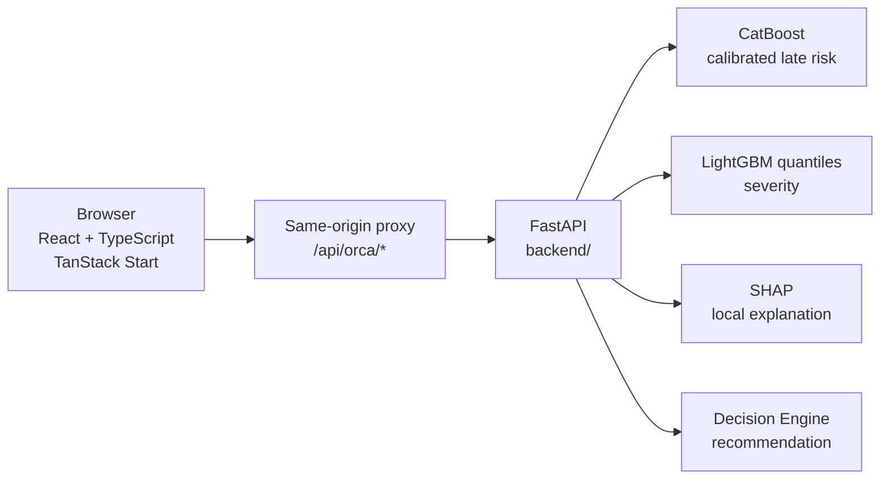

<div align="center">

# ORCA Control Tower

**Supply Chain Decision Intelligence — Sense → Predict → Explain → Simulate → Decide**


**[Live App](https://orca-control-tower.lovable.app)** · **[Repository](https://github.com/EslamTagElsir/orca-control-tower)** · **[Lovable Editor](https://lovable.dev/projects/5f9c9dc3-04f6-409f-8f74-c04ca6fc140c)**

> The repository source may be ahead of the currently published Lovable deployment.

</div>

## Overview

ORCA is an enterprise-style supply-chain decision intelligence system. The repository is organized as a **single monorepo** containing both the interactive Control Tower application and the FastAPI/ML intelligence service that powers prediction, explanation, severity estimation, and recommendations.

```text
Sense → Predict → Explain → Simulate → Decide
```

The frontend remains at the repository root because the project is connected to Lovable/TanStack Start. The backend lives under `backend/` so it can be deployed independently while still being versioned with the rest of the product.

## Repository Structure

```text
orca-control-tower/
├── src/                         # React / TanStack Start application
│   ├── components/              # Control Tower UI and reusable components
│   ├── lib/orca/                # ORCA client, adapters, provenance, simulation
│   └── routes/                  # Product pages + same-origin API proxy
├── public/                      # Frontend static assets
├── backend/                     # FastAPI + ML intelligence service
│   ├── src/delay_intelligence/  # Python intelligence package
│   ├── configs/                 # Model, decision, uncertainty and validation config
│   ├── artifacts/
│   │   ├── model_registry/v2/   # CatBoost, LightGBM and calibration artifacts
│   │   └── causal/              # Exploratory causal stability artifacts
│   ├── Dockerfile               # Railway/container deployment
│   ├── pyproject.toml
│   └── requirements.railway.txt
├── .env.example                 # Frontend proxy environment template
├── package.json                 # Frontend dependencies and scripts
└── README.md
```

`backend/src/delay_intelligence.egg-info` is intentionally not versioned because it is generated packaging metadata rather than source code.

## Product Areas

| Screen | Purpose |
|---|---|
| **Control Tower** | Operational command center with model-backed risk, exceptions, events and KPIs. |
| **Shipments** | Shipment search, inspection, prediction and explanation. |
| **Exceptions** | Action-focused view of model risk and active operational exceptions. |
| **Network Map** | Interactive synthetic route/position visualization with model-derived risk colors. |
| **Analytics** | Completed-journey / holdout outcome analytics and prediction-vs-actual evaluation. |
| **What-If Simulator** | Counterfactual scenario workbench using real ORCA model rescoring. |
| **Decision Economics** | Planning economics around simulated interventions; not realized savings. |
| **Model Monitor** | Model/service health and metadata. |
| **Settings** | ORCA connection and transport configuration. |

## Architecture



The frontend proxy is deliberately allow-listed and only exposes the four supported ORCA contracts. The server-side upstream is configured with `ORCA_API_INTERNAL_URL` (fallback `ORCA_API_URL`) and is not sent to the browser.

## Backend API

| Endpoint | Method | Purpose |
|---|---:|---|
| `/health` | `GET` | Service/model health and serving metadata. |
| `/predict` | `POST` | Calibrated late probability, decision, risk tier and severity uncertainty. |
| `/explain` | `POST` | SHAP predictive drivers plus explicitly exploratory causal candidates. |
| `/recommend` | `POST` | Decision-engine recommendation for a simulated decision scenario. |

No `/demo/*` routes are required or exposed by the current frontend integration.

## ML / Decision Intelligence Layer

The backend currently serves the bundled `v2` registry and includes:

- CatBoost late-risk classifier
- Probability calibration
- LightGBM `q05`, `q50`, `q95` severity models
- Conformal / CQR uncertainty configuration
- SHAP local prediction explanations
- Decision-engine recommendations
- Exploratory causal stability evidence, explicitly not treated as identified intervention effects

The deployed model reports version `v2.0.0-demo` through `/health`.

## Data Provenance & Trust

ORCA intentionally distinguishes source data, model output and simulation.

| Label | Meaning |
|---|---|
| **REAL DATA** | Frozen source/holdout records and completed historical outcomes bundled for the research/demo workflow. |
| **MODEL OUTPUT** | Results returned by `/predict` and `/explain`. |
| **SIMULATED SCENARIO** | What-if inputs and decision scenarios. |
| **SYNTHETIC LIVE OPERATIONS** | Generated operational events used by the digital-twin demonstration. |
| **SYNTHETIC ROUTE / POSITION** | Generated map movement; not GPS, AIS, TMS, ERP or IoT telemetry. |
| **OFFLINE FIXTURE DATA — NOT ORCA OUTPUT** | Explicit fallback state when the intelligence service is unavailable. |

The simulation never directly invents a model probability or risk tier. Risk-dependent UI is updated from real `/predict` responses; when scoring is unavailable the simulated shipment remains **UNSCORED / MODEL OFFLINE**.

## Local Development

### 1. Clone the monorepo

```bash
git clone https://github.com/EslamTagElsir/orca-control-tower.git
cd orca-control-tower
```

### 2. Start the backend

```bash
cd backend
python -m venv .venv
```

Activate the environment for your platform, then:

```bash
pip install -r requirements.railway.txt
```

From `backend/`, start FastAPI with the package source on `PYTHONPATH`:

```bash
PYTHONPATH=src uvicorn delay_intelligence.api.main:app --host 0.0.0.0 --port 8000 --reload
```

On Windows PowerShell the equivalent environment setup is:

```powershell
$env:PYTHONPATH="src"
uvicorn delay_intelligence.api.main:app --host 0.0.0.0 --port 8000 --reload
```

Verify:

```text
http://127.0.0.1:8000/health
```

### 3. Start the frontend

Open another terminal at the repository root:

```bash
npm install
```

Create a local `.env` from the safe template:

```bash
cp .env.example .env
```

For a local backend use:

```text
ORCA_API_INTERNAL_URL=http://127.0.0.1:8000
```

Then:

```bash
npm run dev
```

The browser calls `/api/orca/*`; the TanStack Start server proxy forwards those requests to the configured FastAPI service.

## Deployment

The two applications deploy independently from the same repository.

### Frontend — Lovable

- Repository root: `/`
- Framework: TanStack Start / React
- Backend target: configure `ORCA_API_INTERNAL_URL` in the deployment environment

### Backend — Railway / Docker

Use the same GitHub repository, but configure the Railway service **Root Directory** as:

```text
/backend
```

The backend Dockerfile is then simply:

```text
Dockerfile
```

because Railway builds from the configured `backend/` root. The bundled Dockerfile starts:

```text
uvicorn delay_intelligence.api.main:app --host 0.0.0.0 --port ${PORT:-8000}
```

See [`backend/README_RAILWAY.md`](backend/README_RAILWAY.md) and [`backend/ARCHITECTURE.md`](backend/ARCHITECTURE.md) for backend-specific detail.

## Frontend Scripts

| Script | Purpose |
|---|---|
| `npm run dev` | Start the frontend development server. |
| `npm run build` | Build the frontend for production. |
| `npm run build:dev` | Development-mode build. |
| `npm run preview` | Preview a production build. |
| `npm run lint` | Run ESLint. |
| `npm run format` | Run Prettier. |

## Design Principles

- One product repository, separately deployable frontend and backend services.
- Enterprise operational UX with visible provenance.
- No fabricated model or business metrics.
- Synthetic operational simulation clearly separated from real/holdout data.
- Backend contracts stay explicit and small.
- Model artifacts and serving code are versioned together.
- Architecture is ready for future ERP/TMS/carrier integrations without pretending those integrations exist today.

## Research / Demo Scope

ORCA is a research-validated, demonstration-oriented decision intelligence prototype. The digital-twin operational layer is synthetic unless real tracking systems are explicitly connected later. Historical/holdout analytics and model outputs use their own provenance labels and are never silently mixed with simulated telemetry.

## Legacy Backend Repository

The backend was previously maintained in the separate repository `EslamTagElsir/orca-backend`. The canonical project layout is being consolidated here under `backend/`. The legacy repository should be kept temporarily for rollback/reference until the monorepo deployment has been verified, then it can be archived rather than deleted.

## License

No license file is currently included in this repository.

## Credits

Frontend workflow built with [Lovable](https://lovable.dev/projects/5f9c9dc3-04f6-409f-8f74-c04ca6fc140c). Backend intelligence is served from the `backend/` package in this repository.
