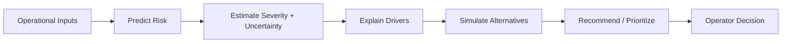
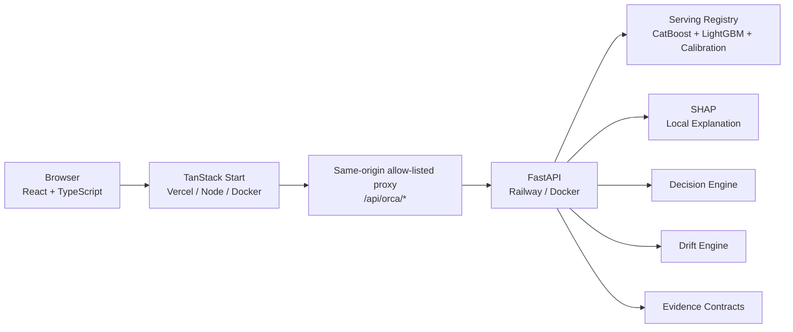

<div align="center">

# ORCA Control Tower

### **Operational Risk & Cost Analytics**

**AI-powered supply-chain decision intelligence for predicting risk, explaining why it matters, simulating alternatives, and supporting better operational decisions.**

**Sense → Predict → Explain → Simulate → Decide**

[](https://github.com/EslamTagElsir/orca-control-tower/actions/workflows/ci.yml)


### [🚀 Live Application](https://orca-control-tower.vercel.app) · [📚 Evidence Policy](docs/EVIDENCE_POLICY.md) · [🔁 Reproducibility](docs/REPRODUCIBILITY.md) · [📈 Monitoring](docs/MONITORING.md)

</div>

---

## What is ORCA?

**ORCA (Operational Risk & Cost Analytics)** is a deployed decision-intelligence prototype for modern logistics and supply-chain operations.

Instead of acting as another dashboard that only reports what already happened, ORCA is designed around a decision workflow:

> **What is likely to go wrong? → How serious could it be? → Why is the model concerned? → What options can we test? → What should an operator prioritize next?**

The platform combines a responsive operational Control Tower with a production-style ML service that supports:

- calibrated shipment risk prediction;
- delay-severity estimation with uncertainty;
- SHAP-based local explanations;
- decision recommendations;
- what-if simulation;
- model reliability evidence;
- drift and monitoring readiness diagnostics;
- exportable evidence packs with explicit provenance.

ORCA is currently a **technically validated prototype**. The predictive layer uses historical evidence; the operational digital-twin layer is explicitly synthetic until real enterprise or IoT/telematics integrations are connected.

---

## Why ORCA?

Logistics teams often discover shipment risk too late, after a delay has already started affecting cost, service levels, customer experience, or downstream operations.

Traditional dashboards are useful for visibility, but visibility alone does not answer the operational questions that matter most:

| Operational question | ORCA capability |
|---|---|
| Which shipments deserve attention first? | Calibrated late-risk scoring and decision tiers |
| How severe could the delay become? | Conditional severity estimates with uncertainty intervals |
| Why is the model raising this risk? | SHAP-based predictive drivers |
| What could happen under a different scenario? | What-if simulation and re-scoring |
| Which action should an operator consider? | Decision-engine recommendation layer |
| Can the model evidence be trusted? | Frozen temporal-holdout reliability and evidence contracts |
| Is live production drift actually connected? | Explicit monitoring-readiness state instead of fabricated metrics |

The goal is to move operational decision-making from **reactive reporting** toward **predictive, explainable, uncertainty-aware decision support**.

---

## Product at a glance

| Area | Current implementation |
|---|---|
| **Product stage** | Deployed and technically tested prototype |
| **Primary use case** | Shipment risk and logistics decision intelligence |
| **Decision flow** | Sense → Predict → Explain → Simulate → Decide |
| **Frontend** | React 19 + TypeScript + TanStack Start |
| **Backend** | FastAPI ML service |
| **Risk model** | CatBoost classification + isotonic calibration |
| **Severity model** | LightGBM conditional quantile models |
| **Uncertainty** | Split CQR evidence and prediction intervals |
| **Explainability** | Local SHAP explanations |
| **Deployment** | Vercel frontend + Railway backend |
| **Current model registry** | `v2.0.0-demo` |
| **Prediction contract** | `v1.0` |

---

## Decision workflow



ORCA deliberately keeps the **human operator in the decision loop**. It is a decision-support system, not an autonomous execution engine.

---

## Product experience

### Operations

| Screen | Purpose |
|---|---|
| **Control Tower** | Executive command center for operational risk, exceptions, events, and KPIs |
| **Shipments** | Search, inspect, predict, and explain individual shipment risk |
| **Exceptions** | Prioritized view of operational risks requiring attention |
| **Resolution Hub** | Decision-oriented workflow for reviewing potential interventions |
| **Network Map** | Visual route/position demonstration with explicit synthetic-data provenance |

### Intelligence

| Screen | Purpose |
|---|---|
| **Analytics** | Completed-journey and holdout outcome analysis |
| **What-If Simulator** | Modify scenario inputs and re-score them through the ORCA model |
| **Decision Economics** | Planning economics for simulated interventions; not claimed realized savings |

### Governance

| Screen | Purpose |
|---|---|
| **Model Reliability** | Registry-backed temporal-holdout performance and uncertainty evidence |
| **Drift Readiness** | Separates drift capability, historical evaluation, and live monitoring status |
| **Evidence Reports** | Exportable JSON / Markdown evidence packs with provenance preserved |
| **Settings & Diagnostics** | Backend connectivity, health, reliability, and monitoring diagnostics |

The application is responsive across desktop and mobile layouts.

---

## AI & decision-intelligence layer

The current serving registry includes:

### Risk prediction

- **CatBoost** late-risk classifier;
- isotonic probability calibration;
- frozen decision threshold;
- operational decision tiers.

### Delay severity and uncertainty

- **LightGBM** `q05`, `q50`, and `q95` conditional severity models;
- split conformalized quantile regression (**CQR**) evidence;
- interval coverage and interval-width diagnostics.

### Explainability

- local **SHAP** predictive explanations;
- ranked model drivers for individual decisions;
- exploratory causal-stability evidence kept separate from predictive claims.

### Decision support

- recommendation engine for simulated decision requests;
- what-if scenario re-scoring;
- planning economics without presenting simulated savings as realized financial impact.

---

## System architecture

ORCA is a monorepo with independently deployable frontend and backend layers.



The browser never talks directly to an arbitrary backend path. The TanStack server exposes an explicit allow-list under `/api/orca/*` and forwards only supported contracts to the FastAPI service.

---

## API contracts

The current frontend uses six explicit backend contracts:

| Endpoint | Method | Purpose |
|---|---:|---|
| `/health` | `GET` | Service/model health and serving metadata |
| `/reliability` | `GET` | Frozen serving-registry temporal-holdout reliability evidence |
| `/monitoring-readiness` | `GET` | Drift/production-monitoring readiness and blockers |
| `/predict` | `POST` | Calibrated late-risk probability, tier, and severity uncertainty |
| `/explain` | `POST` | SHAP predictive drivers plus exploratory causal candidates |
| `/recommend` | `POST` | Decision-engine recommendation for a simulated request |

The production frontend accesses these through the same-origin proxy:

```text
/api/orca/health
/api/orca/reliability
/api/orca/monitoring-readiness
/api/orca/predict
/api/orca/explain
/api/orca/recommend
```

---

## Evidence, reliability & trust

A core design principle of ORCA is that **research evidence, model output, synthetic operations, and production telemetry must not be mixed together**.

### Evidence labels

| Label | Meaning |
|---|---|
| **REAL DATA** | Frozen source/holdout records and completed historical outcomes used by the research/demo workflow |
| **MODEL OUTPUT** | Prediction and explanation outputs from the serving model |
| **SIMULATED SCENARIO** | What-if inputs and planning context |
| **SYNTHETIC LIVE OPERATIONS** | Generated operational events used by the digital-twin demonstration |
| **SYNTHETIC ROUTE / POSITION** | Generated map movement; not GPS/AIS/TMS/ERP/IoT telemetry |
| **PRODUCTION MONITORING** | Separately versioned monitoring evidence that satisfies the production contract |
| **OFFLINE FIXTURE DATA — NOT ORCA OUTPUT** | Explicit fallback data when the intelligence service is unavailable |

### Reliability evidence

`GET /reliability`, **Model Reliability**, and **Evidence Reports** read locked serving-registry validation artifacts rather than recalculating convenient metrics at request time.

The registry includes temporal-holdout evidence such as:

- ROC-AUC and PR-AUC;
- Brier score;
- precision, recall, F1, and balanced accuracy;
- frozen decision threshold;
- CQR empirical coverage;
- interval-width diagnostics.

These are **historical temporal-holdout measurements**, not live production SLA or live drift claims.

### Monitoring readiness

ORCA separates three evidence layers:

1. **Serving-registry reliability** — immutable temporal-holdout evidence.
2. **Historical development drift** — chronological development/CV analysis.
3. **Live production drift** — only valid after a production monitoring artifact is connected and validated.

Until that artifact exists, `/monitoring-readiness` intentionally reports `NOT_CONNECTED` with explicit blockers instead of inventing live drift values.

See [Monitoring](docs/MONITORING.md) and [Evidence Policy](docs/EVIDENCE_POLICY.md).

---

## Live deployment

### Frontend

**Production application:** https://orca-control-tower.vercel.app

The frontend runs from the repository root using the native TanStack Start + Nitro toolchain. It no longer requires Lovable packages to build or run.

### Backend

The canonical backend lives inside this monorepo under:

```text
/backend
```

It is deployed independently using the backend Dockerfile and FastAPI/Uvicorn runtime.

The frontend receives the backend base URL through the server-side environment variable:

```text
ORCA_API_INTERNAL_URL=https://YOUR-ORCA-BACKEND
```

This keeps backend routing server-side and avoids exposing deployment configuration as a browser-side runtime dependency.

---

## Repository structure

```text
orca-control-tower/
├── src/
│   ├── components/orca/              # application shell + ORCA UI primitives
│   ├── lib/orca/                     # transport, evidence, monitoring clients
│   └── routes/                       # product routes + same-origin proxy
├── backend/
│   ├── src/delay_intelligence/       # FastAPI + prediction/decision/drift packages
│   ├── configs/                      # model and decision configuration
│   ├── artifacts/model_registry/v2/  # serving registry + validation evidence
│   ├── contracts/                    # formal evidence contracts
│   ├── tests/                        # API / evidence / monitoring tests
│   ├── Dockerfile
│   └── requirements.railway.txt
├── docs/
│   ├── EVIDENCE_POLICY.md
│   ├── MONITORING.md
│   └── REPRODUCIBILITY.md
├── public/
├── Dockerfile                        # standalone frontend container
├── vite.config.ts                    # native TanStack Start + Nitro build
├── .github/workflows/ci.yml
└── README.md
```

---

## Run locally

### 1. Backend

```bash
cd backend
python -m venv .venv
pip install -r requirements.railway.txt
```

macOS / Linux:

```bash
PYTHONPATH=src uvicorn delay_intelligence.api.main:app --host 0.0.0.0 --port 8000 --reload
```

PowerShell:

```powershell
$env:PYTHONPATH="src"
uvicorn delay_intelligence.api.main:app --host 0.0.0.0 --port 8000 --reload
```

Verify:

```text
http://127.0.0.1:8000/health
http://127.0.0.1:8000/reliability
http://127.0.0.1:8000/monitoring-readiness
```

### 2. Frontend

From the repository root:

```bash
bun install --frozen-lockfile
cp .env.example .env
bun run dev
```

Set the local backend URL:

```text
ORCA_API_INTERNAL_URL=http://127.0.0.1:8000
```

Then open the local frontend and use `/settings` to verify the backend connection.

### Production-style frontend

```bash
bun run build
ORCA_API_INTERNAL_URL=http://127.0.0.1:8000 bun run start
```

The Nitro build emits:

```text
.output/server/index.mjs
```

---

## Docker

### Frontend

```bash
docker build -t orca-frontend .
```

```bash
docker run --rm \
  -p 3000:3000 \
  -e PORT=3000 \
  -e HOST=0.0.0.0 \
  -e ORCA_API_INTERNAL_URL=http://host.docker.internal:8000 \
  orca-frontend
```

### Backend

```bash
cd backend
docker build -t orca-backend .
```

The backend container starts the FastAPI application using Uvicorn and the platform-provided `PORT`.

---

## CI & reproducibility

GitHub Actions validates the deployable frontend/backend contract through:

- frozen Bun dependency installation;
- checks preventing Lovable build/runtime packages from being reintroduced;
- targeted ESLint validation for hardened ORCA surfaces;
- full frontend production build;
- frontend Docker image build and HTTP smoke test;
- Python source compilation;
- API / registry / monitoring contract tests;
- full-stack Docker smoke testing across backend → frontend proxy contracts.

The current `main` deployment path has been externally validated through both **Vercel** and **Railway** deployment checks.

For a reproducible local workflow, see [docs/REPRODUCIBILITY.md](docs/REPRODUCIBILITY.md).

---

## Target users & product direction

ORCA is designed for organizations that manage high-volume or operationally complex logistics, including:

- logistics and transportation operators;
- third-party logistics providers (**3PLs**);
- fleet and control-tower teams;
- e-commerce fulfillment networks;
- enterprises managing multi-party supply chains.

Primary users include operations managers, logistics planners, control-tower analysts, and supply-chain decision makers.

### Next-stage roadmap

The current prototype validates the core decision-intelligence layer. Future product development is intended to focus on:

- pilot deployments with logistics operators;
- real operational data ingestion;
- TMS / ERP integration;
- GPS, telematics, and IoT/AIoT connectivity where available;
- live production monitoring artifacts;
- organization-level authentication and permissions;
- business-model and market validation;
- scalable regional deployment.

These items are **roadmap targets**, not claims about integrations already present in the current prototype.

---

## Team

**Eslam TagElsir Ali — Team Leader**

Project team:

- Ahmed Shehta
- Mohamed Hassan
- Ahmed Ibrahim
- Osama Mohamed

---

## Design principles

- **Decision support, not automated operational control.**
- **GitHub is the canonical source of truth.**
- **One product repository, independently deployable frontend and backend services.**
- **No fabricated model, monitoring, or business metrics.**
- **Synthetic operations are never presented as real telemetry.**
- **Historical holdout reliability is never presented as live production drift.**
- **Model uncertainty and evidence boundaries remain visible to the operator.**
- **Future enterprise/IoT integrations are described as roadmap work until actually connected.**

---

## Current scope

ORCA is a **research-validated, demonstration-oriented decision-intelligence prototype** moving toward real-world pilot validation.

The predictive serving registry is backed by historical evidence. The current operational simulation and route/position layer remain synthetic unless real operational systems are explicitly connected.

This boundary is intentional: ORCA is designed to demonstrate what a production-grade decision-intelligence workflow should look like **without presenting synthetic activity as real-world operational truth**.

---

## License

No license file is currently included in this repository. Repository visibility does not imply permission to reuse, redistribute, or commercialize the code.
